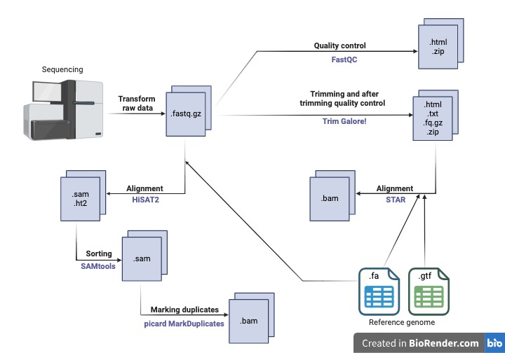

# Simple RNA-Seq Pipeline using Nextflow



This pipeline is a RNA-Seq analysis workflow implemented using Nextflow. The workflow includes quality 
control, trimming, alignment, sorting of aligned files and marking of duplicates using popular tools like FastQC, TrimGalore, HISAT2, STAR, SAMtools, and picard. 

## Workflow Overview
The pipeline performs the following steps:

1. Read and Validate Samplesheet: The input samplesheet (CSV) contains information about the samples, such as the sample name, 
strandedness, and the paths to paired-end FASTQ files.

2. FASTQ Quality Control (FastQC): Performs quality control checks on raw FASTQ files using FastQC.

3. Trimming (TrimGalore): Trims adapters and low-quality regions from the FASTQ files.

4. Alignment (HISAT2 or STAR): Aligns the trimmed FASTQ files to the reference genome.

5. Sorting (SAMtools): Sorts the aligned SAM files.

6. Mark duplicates (picard): Identifies and marks duplicate reads in the sorted files.


## Channels

The pipeline defines several channels to manage input files and processed data:

- Samplesheet Channel: This channel reads the input samplesheet file, which contains metadata about the samples.

- Python Validation Channel: This channel loads the Python script used for validating the samplesheet.

- Reads Channel: This channel processes the samplesheet, splitting it into structured data for each sample, including information about strandedness and the corresponding paired-end FASTQ files.

- Reference Genome Channel: This channel provides access to the reference genome in FASTA format.

- GTF Channel: This channel is for the Gene Transfer Format (GTF) file, which contains gene annotations.

- Tuple Channel: This channel further structures the input data, focusing on individual sample attributes and their associated FASTQ file paths.

## Usage

> [!NOTE]
> If you are new to Nextflow and nf-core, please get familiar to these tools. Make sure to install nextflow version 23.10, which only runs in mac-os, linux, or WSL.

First, prepare a samplesheet with your input data that should have the same structure, file name, and column names as this example samplesheet:

**samplesheet.csv**:

```csv
sample,fastq_1,fastq_2,strandedness
SRR6357070,'./data/SRR6357070_1.fastq.gz','./data/SRR6357070_2.fastq.gz',auto
```

Each row represents a pair of fastq files (paired end). This tool does not allow single end data.
The strandedness refers to the library preparation and will be automatically inferred if set to `auto`.

## Executing the Pipeline

### Parameters
```bash
-profile: Use <docker/singularity/.../institute>

--samplesheet: The path to the samplesheet CSV file containing sample information. 
The default value is './data/samplesheet.csv'.

--fasta: The path to the reference genome file (FASTA format). 
The default value is "./data/genome.fa" .   
You can use the genome data from here: https://github.com/nf-core/test-datasets/tree/rnaseq/reference

--gtf: The path to the gene annotation file (GTF format). 
The default value is "./data/genes.gtf". 
You can use the genome data from here: https://github.com/nf-core/test-datasets/tree/rnaseq/reference

-align: Specifies whether to use HISAT2 or STAR as alignment tools. Use <HISAT2/ STAR>. 
The default is 'HISAT2'.
```

### Now, you can run the pipeline using:

```bash
nextflow run main.nf -profile <docker/singularity/.../institute>
```

Add more parameters if needed from the list above.

> [!NOTE]
> Make sure the input files (samplesheet and reference genome) are correctly formatted and accessible before running the workflow.

## Pipeline output

To see the results of the different tools refer to the results folder. For more details about the output files and reports, please refer to the documentation of the used tools.

## License
This example shows a simplified version. Once the file is pushed to GitHub, the README will be automatically displayed when someone 
visits the repository.